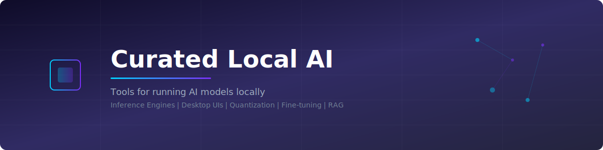

  

<h1 align="center">Curated Local AI</h1>

  <strong>A curated list of tools for running AI models locally -- inference engines, UIs, and optimization.</strong>

  
  
  
  
  

  <a href="#inference-engines">Inference Engines</a> &bull;
  <a href="#desktop--web-uis">Desktop & Web UIs</a> &bull;
  <a href="#model-hubs--formats">Model Hubs</a> &bull;
  <a href="#quantization-tools">Quantization</a> &bull;
  <a href="#fine-tuning">Fine-tuning</a> &bull;
  <a href="#local-rag">Local RAG</a> &bull;
  <a href="#voice--speech">Voice & Speech</a> &bull;
  <a href="#image-generation">Image Gen</a> &bull;
  <a href="#hardware-guides">Hardware</a>

---

## Featured

> ### [Ssemble AI Clipping](https://www.ssemble.com) -- Turn long videos into viral shorts with AI
>
> Ssemble uses AI to automatically find the best moments in your videos and create short-form clips optimized for TikTok, YouTube Shorts, and Instagram Reels. Available as an [MCP server](https://www.npmjs.com/package/@ssemble/mcp-server) for integration into your AI workflows.
>
>  

---

## Contents

- [Inference Engines](#inference-engines)
- [Desktop & Web UIs](#desktop--web-uis)
- [Model Hubs & Formats](#model-hubs--formats)
- [Quantization Tools](#quantization-tools)
- [Fine-tuning](#fine-tuning)
- [Local RAG](#local-rag)
- [Voice & Speech](#voice--speech)
- [Image Generation](#image-generation)
- [Hardware Guides](#hardware-guides)
- [Recently Added](#recently-added)
- [Related Lists](#related-lists)
- [Contributing](#contributing)

---

## Inference Engines

Run large language models locally with optimized inference.

| Tool | Description | Platform | License |
|------|-------------|----------|---------|
| [Ollama](https://github.com/ollama/ollama) | Get up and running with large language models locally. Simple CLI with model management. | macOS, Linux, Windows | MIT |
| [llama.cpp](https://github.com/ggerganov/llama.cpp) | LLM inference in C/C++. The foundational project for GGUF-based local inference. | Cross-platform | MIT |
| [vLLM](https://github.com/vllm-project/vllm) | High-throughput and memory-efficient inference and serving engine for LLMs. | Linux | Apache-2.0 |
| [TensorRT-LLM](https://github.com/NVIDIA/TensorRT-LLM) | NVIDIA's library for optimizing LLM inference on NVIDIA GPUs. | Linux (NVIDIA) | Apache-2.0 |
| [MLX](https://github.com/ml-explore/mlx) | Array framework for machine learning on Apple silicon, by Apple. | macOS (Apple Silicon) | MIT |
| [MLC LLM](https://github.com/mlc-ai/mlc-llm) | Universal LLM deployment engine with ML compilation. Supports phones, browsers, and more. | Cross-platform | Apache-2.0 |
| [ExLlamaV2](https://github.com/turboderp/exllamav2) | Fast inference library for running LLMs locally on modern consumer GPUs. | Linux, Windows | MIT |
| [LocalAI](https://github.com/mudler/LocalAI) | Drop-in replacement REST API compatible with OpenAI. No GPU required. | Cross-platform | MIT |
| [Llamafile](https://github.com/Mozilla-Ocho/llamafile) | Distribute and run LLMs with a single file. By Mozilla. | Cross-platform | Apache-2.0 |
| [candle](https://github.com/huggingface/candle) | Minimalist ML framework for Rust with a focus on performance. | Cross-platform | MIT/Apache-2.0 |
| [llama-cpp-python](https://github.com/abetlen/llama-cpp-python) | Python bindings for llama.cpp with OpenAI-compatible API server. | Cross-platform | MIT |
| [LMDeploy](https://github.com/InternLM/lmdeploy) | Toolkit for compressing, deploying, and serving LLMs with high throughput. | Linux | Apache-2.0 |
| [SGLang](https://github.com/sgl-project/sglang) | Fast serving framework for large language and vision models. | Linux | Apache-2.0 |
| [ctransformers](https://github.com/marella/ctransformers) | Python bindings for GGML models with GPU acceleration support. | Cross-platform | MIT |

<a href="#contents">Back to top</a>

---

## Desktop & Web UIs

User-friendly interfaces for interacting with local models.

| Tool | Description | Platform | License |
|------|-------------|----------|---------|
| [Open WebUI](https://github.com/open-webui/open-webui) | Feature-rich, self-hosted web UI for LLMs. Supports Ollama and OpenAI-compatible APIs. | Web (Self-hosted) | MIT |
| [LM Studio](https://lmstudio.ai/) | Desktop app to discover, download, and run local LLMs. Built-in chat and server. | macOS, Windows, Linux | Proprietary (Free) |
| [GPT4All](https://github.com/nomic-ai/gpt4all) | Open-source large language model chatbot ecosystem. Run models entirely offline. | macOS, Windows, Linux | MIT |
| [Jan](https://github.com/janhq/jan) | Open-source alternative to ChatGPT that runs 100% offline on your computer. | macOS, Windows, Linux | AGPL-3.0 |
| [Msty](https://msty.app/) | Desktop AI chat app supporting multiple local and online models. | macOS, Windows, Linux | Proprietary (Free) |
| [Text Generation WebUI](https://github.com/oobabooga/text-generation-webui) | Gradio-based web UI for running large language models. Supports many backends. | Web (Self-hosted) | AGPL-3.0 |
| [KoboldCpp](https://github.com/LostRuins/koboldcpp) | Easy-to-use AI text generation with GGUF support. Single file executable. | macOS, Windows, Linux | AGPL-3.0 |
| [SillyTavern](https://github.com/SillyTavern/SillyTavern) | LLM frontend for power users. Advanced character and roleplay features. | Web (Self-hosted) | AGPL-3.0 |
| [AnythingLLM](https://github.com/Mintplex-Labs/anything-llm) | All-in-one desktop and Docker AI app with built-in RAG, agents, and more. | macOS, Windows, Linux | MIT |
| [Chatbox](https://github.com/Bin-Huang/chatbox) | Desktop client for ChatGPT, Claude, and local models (Ollama). | macOS, Windows, Linux | GPL-3.0 |
| [LibreChat](https://github.com/danny-avila/LibreChat) | Enhanced ChatGPT clone supporting many AI providers including local models. | Web (Self-hosted) | MIT |
| [Lobe Chat](https://github.com/lobehub/lobe-chat) | Modern-design ChatGPT/LLM UI framework supporting Ollama and local providers. | Web (Self-hosted) | MIT |

<a href="#contents">Back to top</a>

---

## Model Hubs & Formats

Where to find models and understand their formats.

| Resource | Description | Type |
|----------|-------------|------|
| [Hugging Face Hub](https://huggingface.co/models) | The largest open-source ML model repository. Hosts thousands of LLMs, vision models, and more. | Model Hub |
| [GGUF Format](https://github.com/ggerganov/ggml/blob/master/docs/gguf.md) | Binary format designed for fast loading and saving of models used by llama.cpp. | Format Spec |
| [GGML](https://github.com/ggerganov/ggml) | Tensor library for machine learning. The foundation behind GGUF and llama.cpp. | Library |
| [ModelScope](https://modelscope.cn/models) | Open-source model hub by Alibaba DAMO Academy with thousands of models. | Model Hub |
| [Ollama Library](https://ollama.com/library) | Curated collection of models optimized and packaged for Ollama. | Model Library |
| [TheBloke (HF)](https://huggingface.co/TheBloke) | Prolific quantizer providing GGUF, GPTQ, and AWQ versions of popular models. | Quantized Models |
| [bartowski (HF)](https://huggingface.co/bartowski) | Provides high-quality GGUF quantizations of the latest open-source models. | Quantized Models |
| [SafeTensors](https://github.com/huggingface/safetensors) | Simple, safe way to store and distribute tensors. Fast and secure by Hugging Face. | Format/Library |
| [Open LLM Leaderboard](https://huggingface.co/spaces/open-llm-leaderboard/open_llm_leaderboard) | Benchmark leaderboard tracking and comparing open-source LLMs. | Benchmark |
| [LMSYS Chatbot Arena](https://chat.lmsys.org/) | Crowdsourced platform for comparing LLMs via blind pairwise voting. | Benchmark |

<a href="#contents">Back to top</a>

---

## Quantization Tools

Reduce model size and memory requirements for local inference.

| Tool | Description | Method |
|------|-------------|--------|
| [GPTQ](https://github.com/IST-DASLab/gptq) | Accurate post-training quantization for generative pre-trained transformers. | Post-training (4-bit) |
| [AutoGPTQ](https://github.com/AutoGPTQ/AutoGPTQ) | Easy-to-use LLM quantization package with user-friendly APIs based on GPTQ. | Post-training (4-bit) |
| [AWQ](https://github.com/mit-han-lab/llm-awq) | Activation-aware weight quantization for efficient LLM compression and acceleration. | Post-training (4-bit) |
| [llama.cpp quantize](https://github.com/ggerganov/llama.cpp/tree/master/examples/quantize) | Built-in quantization tool for creating GGUF models at various bit levels. | Post-training (2-8 bit) |
| [bitsandbytes](https://github.com/bitsandbytes-foundation/bitsandbytes) | Lightweight wrapper around CUDA functions for 8-bit and 4-bit quantization. | Dynamic (4/8-bit) |
| [QLoRA](https://github.com/artidoro/qlora) | Efficient finetuning of quantized LLMs. Combines quantization with LoRA. | Fine-tune + Quant |
| [GGUF Quantization Guide](https://huggingface.co/docs/hub/en/gguf) | Hugging Face documentation on GGUF format and quantization methods. | Documentation |
| [HQQ](https://github.com/mobiusml/hqq) | Half-Quadratic Quantization -- fast and accurate weight-only quantization. | Post-training |
| [SqueezeLLM](https://github.com/SqueezeAILab/SqueezeLLM) | Dense-and-sparse quantization for efficient LLM serving. | Post-training |
| [QuIP#](https://github.com/Cornell-RelaxML/quip-sharp) | Quantization with incoherence processing for extreme LLM compression. | Post-training (2-bit) |
| [AQLM](https://github.com/Vahe1994/AQLM) | Additive quantization of language models achieving state-of-the-art 2-bit compression. | Post-training (2-bit) |

<a href="#contents">Back to top</a>

---

## Fine-tuning

Customize and train models locally.

| Tool | Description | Method |
|------|-------------|--------|
| [Unsloth](https://github.com/unslothai/unsloth) | Finetune LLMs 2-5x faster with 80% less memory. Supports Llama, Mistral, and more. | LoRA/QLoRA |
| [Axolotl](https://github.com/axolotl-ai-cloud/axolotl) | Streamlined tool for fine-tuning LLMs. Supports many model architectures and methods. | Full/LoRA/QLoRA |
| [LLaMA-Factory](https://github.com/hiyouga/LLaMA-Factory) | Unified framework for fine-tuning 100+ LLMs with a web UI. | Full/LoRA/QLoRA |
| [PEFT](https://github.com/huggingface/peft) | Parameter-Efficient Fine-Tuning library by Hugging Face. Implements LoRA, prefix tuning, etc. | LoRA/Adapters |
| [LoRA](https://github.com/microsoft/LoRA) | Low-Rank Adaptation of Large Language Models. The original implementation by Microsoft. | LoRA |
| [TRL](https://github.com/huggingface/trl) | Transformer Reinforcement Learning library. RLHF, DPO, PPO training by Hugging Face. | RLHF/DPO |
| [MLX Fine-tuning](https://github.com/ml-explore/mlx-examples/tree/main/llms/mlx_lm) | Fine-tuning examples for Apple Silicon using the MLX framework. | LoRA/QLoRA |
| [torchtune](https://github.com/pytorch/torchtune) | PyTorch-native library for LLM fine-tuning. First-party support from PyTorch. | Full/LoRA/QLoRA |
| [LitGPT](https://github.com/Lightning-AI/litgpt) | Pretrain, finetune, and deploy 20+ LLMs on your own data. By Lightning AI. | Full/LoRA/Adapter |
| [OpenRLHF](https://github.com/OpenRLHF/OpenRLHF) | High-performance RLHF framework built on Ray, vLLM, and DeepSpeed. | RLHF/DPO/PPO |
| [Ludwig](https://github.com/ludwig-ai/ludwig) | Low-code framework for building custom AI models including LLM fine-tuning. | Full/LoRA |

<a href="#contents">Back to top</a>

---

## Local RAG

Retrieval-augmented generation tools that keep your data private.

| Tool | Description | Backend |
|------|-------------|---------|
| [PrivateGPT](https://github.com/zylon-ai/private-gpt) | Interact with your documents using LLMs, 100% privately, no data leaves your machine. | llama.cpp/Ollama |
| [Quivr](https://github.com/QuivrHQ/quivr) | Your second brain, powered by generative AI. Personal productivity assistant. | Multiple |
| [LocalGPT](https://github.com/PromtEngineer/localGPT) | Chat with your documents on your local device. Inspired by privateGPT. | Hugging Face |
| [Khoj](https://github.com/khoj-ai/khoj) | Personal AI assistant for your notes, documents, and images. Self-hostable. | Multiple |
| [AnythingLLM](https://github.com/Mintplex-Labs/anything-llm) | All-in-one desktop AI app with built-in RAG, agents, and multi-user support. | Multiple |
| [Danswer](https://github.com/danswer-ai/danswer) | Open-source enterprise question-answering over your company's documents. | Multiple |
| [Open WebUI (RAG)](https://docs.openwebui.com/features/rag/) | Built-in RAG support in Open WebUI for document-grounded conversations. | Ollama/OpenAI |
| [Verba](https://github.com/weaviate/Verba) | The Golden RAGtriever. Open-source RAG application built on Weaviate. | Weaviate |
| [RAGFlow](https://github.com/infiniflow/ragflow) | Open-source RAG engine based on deep document understanding. | Multiple |
| [kotaemon](https://github.com/Cinnamon/kotaemon) | Clean and customizable RAG UI for chatting with your documents. | Multiple |
| [Haystack](https://github.com/deepset-ai/haystack) | LLM orchestration framework for building RAG, agents, and search pipelines. | Multiple |

<a href="#contents">Back to top</a>

---

## Voice & Speech

Local speech recognition, text-to-speech, and voice assistants.

| Tool | Description | Type |
|------|-------------|------|
| [Whisper.cpp](https://github.com/ggerganov/whisper.cpp) | High-performance inference of OpenAI's Whisper model in C/C++. | Speech-to-Text |
| [Piper](https://github.com/rhasspy/piper) | Fast, local neural text-to-speech system optimized for Raspberry Pi. | Text-to-Speech |
| [Coqui TTS](https://github.com/coqui-ai/TTS) | Deep learning toolkit for text-to-speech. Supports many languages and voices. | Text-to-Speech |
| [Bark](https://github.com/suno-ai/bark) | Text-prompted generative audio model by Suno. Creates realistic speech and sound effects. | Text-to-Audio |
| [faster-whisper](https://github.com/SYSTRAN/faster-whisper) | Reimplementation of Whisper using CTranslate2, up to 4x faster. | Speech-to-Text |
| [WhisperX](https://github.com/m-bain/whisperX) | Whisper with word-level timestamps, speaker diarization, and VAD. | Speech-to-Text |
| [OpenedAI Speech](https://github.com/matatonic/openedai-speech) | OpenAI-compatible TTS API server using local models (Piper, Coqui, etc.). | Text-to-Speech |
| [Vosk](https://github.com/alphacep/vosk-api) | Offline speech recognition API supporting 20+ languages. Works on edge devices. | Speech-to-Text |
| [StyleTTS 2](https://github.com/yl4579/StyleTTS2) | Human-level text-to-speech through style diffusion and adversarial training. | Text-to-Speech |
| [XTTS](https://github.com/coqui-ai/TTS) | Cross-lingual voice cloning and text-to-speech from Coqui. Clone with 6 seconds of audio. | Text-to-Speech |
| [Silero Models](https://github.com/snakers4/silero-models) | Pre-trained speech-to-text, text-to-speech, and text enhancement models. | STT/TTS |

<a href="#contents">Back to top</a>

---

## Image Generation

Run image generation and editing models locally.

| Tool | Description | Backend |
|------|-------------|---------|
| [ComfyUI](https://github.com/comfyanonymous/ComfyUI) | Powerful and modular Stable Diffusion GUI and backend with node-based workflow. | PyTorch |
| [Automatic1111 (SD WebUI)](https://github.com/AUTOMATIC1111/stable-diffusion-webui) | The most popular Stable Diffusion web UI with extensive extension ecosystem. | PyTorch |
| [Fooocus](https://github.com/lllyasviel/Fooocus) | Focus on prompting and generating. Offline, open source, free Midjourney-like experience. | PyTorch |
| [InvokeAI](https://github.com/invoke-ai/InvokeAI) | Professional creative engine for Stable Diffusion with a polished node-based UI. | PyTorch |
| [SD.Next](https://github.com/vladmandic/automatic) | Advanced Stable Diffusion implementation with latest research features. | PyTorch |
| [Forge (SD WebUI)](https://github.com/lllyasviel/stable-diffusion-webui-forge) | Optimized fork of Automatic1111 with better memory management and speed. | PyTorch |
| [Draw Things](https://drawthings.ai/) | AI-assisted image generation app for Apple devices. Runs entirely on-device. | Core ML/MPS |
| [DiffusionBee](https://github.com/divamgupta/diffusionbee-stable-diffusion-ui) | Easiest way to run Stable Diffusion locally on your Mac. One-click install. | Core ML |
| [FLUX.1 (Black Forest Labs)](https://github.com/black-forest-labs/flux) | State-of-the-art text-to-image model family. Open weights available. | PyTorch |
| [Stable Diffusion XL](https://github.com/Stability-AI/generative-models) | Stability AI's advanced image generation model with improved quality. | PyTorch |
| [kohya-ss](https://github.com/kohya-ss/sd-scripts) | Training scripts for Stable Diffusion. LoRA, DreamBooth, and textual inversion. | PyTorch |

<a href="#contents">Back to top</a>

---

## Hardware Guides

Optimize your local AI setup with the right hardware.

| Resource | Description | Focus |
|----------|-------------|-------|
| [GPU Benchmarks for LLMs](https://github.com/XiongjieDai/GPU-Benchmarks-on-LLM-Inference) | Comprehensive benchmarks of GPUs for local LLM inference performance. | GPU Comparison |
| [Apple Silicon GPU Guide](https://github.com/ggerganov/llama.cpp/discussions/4167) | Discussion and benchmarks for running llama.cpp on Apple Silicon Macs. | Apple Silicon |
| [llama.cpp Hardware Compat](https://github.com/ggerganov/llama.cpp#supported-backends) | Official list of supported hardware backends for llama.cpp. | Compatibility |
| [MLX Benchmarks](https://github.com/ml-explore/mlx-examples) | Performance examples and benchmarks for Apple Silicon ML workloads. | Apple Silicon |
| [VRAM Calculator](https://huggingface.co/spaces/NyxKrage/LLM-Model-VRAM-Calculator) | Calculate the VRAM requirements for running various LLM models. | Memory Planning |
| [RTX AI Toolkit](https://developer.nvidia.com/rtx-ai-toolkit) | NVIDIA's toolkit for optimizing and deploying AI models on RTX GPUs. | NVIDIA RTX |
| [AMD ROCm](https://github.com/ROCm/ROCm) | AMD's open-source software platform for GPU computing. Supports many ML frameworks. | AMD GPU |
| [Vulkan Backend (llama.cpp)](https://github.com/ggerganov/llama.cpp/blob/master/docs/backend/VULKAN.md) | Guide for using the Vulkan backend for cross-GPU support in llama.cpp. | Cross-GPU |
| [Local AI Hardware Guide (Reddit)](https://www.reddit.com/r/LocalLLaMA/wiki/index/) | Community-maintained wiki with hardware recommendations for local LLMs. | General |

<a href="#contents">Back to top</a>

---

## Recently Added

*Last updated: March 2026*

- **[SGLang](https://github.com/sgl-project/sglang)** -- Fast serving framework for large language and vision models
- **[kotaemon](https://github.com/Cinnamon/kotaemon)** -- Clean, customizable RAG UI for chatting with documents
- **[RAGFlow](https://github.com/infiniflow/ragflow)** -- Open-source RAG engine based on deep document understanding
- **[Forge](https://github.com/lllyasviel/stable-diffusion-webui-forge)** -- Optimized SD WebUI fork with better memory management
- **[torchtune](https://github.com/pytorch/torchtune)** -- PyTorch-native library for LLM fine-tuning
- **[FLUX.1](https://github.com/black-forest-labs/flux)** -- State-of-the-art text-to-image model family by Black Forest Labs

---

## Related Lists

- [Awesome LLM](https://github.com/Hannibal046/Awesome-LLM) -- Curated list of large language model resources
- [Awesome LLMOps](https://github.com/tensorchord/Awesome-LLMOps) -- Curated list of LLMOps tools
- [Awesome Generative AI](https://github.com/steven2358/awesome-generative-ai) -- Curated list of modern generative AI projects
- [Awesome Self-Hosted](https://github.com/awesome-selfhosted/awesome-selfhosted) -- Self-hosting software list
- [Open LLMs](https://github.com/eugeneyan/open-llms) -- List of open-source LLMs available for commercial use
- [LocalLLaMA Wiki](https://www.reddit.com/r/LocalLLaMA/wiki/index/) -- Community wiki for local LLM enthusiasts

---

## Contributing

Contributions are welcome! Please read the [contributing guidelines](CONTRIBUTING.md) before submitting a pull request.

If you find this list useful, please consider giving it a star. It helps others discover it.

---

  Curated with care by the <a href="https://github.com/awesome-ai-tools">awesome-ai-tools</a> community.

